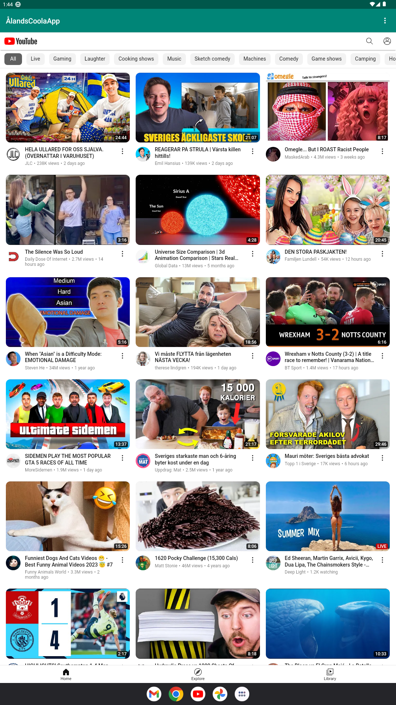

# Rapport

**Skriv din rapport här!**


## Följande grundsyn gäller dugga-svar:

- Ett kortfattat svar är att föredra. Svar som är längre än en sida text (skärmdumpar och programkod exkluderat) är onödigt långt.
- Svaret skall ha minst en snutt programkod.
- Svaret skall inkludera en kort övergripande förklarande text som redogör för vad respektive snutt programkod gör eller som svarar på annan teorifråga.
- Svaret skall ha minst en skärmdump. Skärmdumpar skall illustrera exekvering av relevant programkod. Eventuell text i skärmdumpar måste vara läsbar.
- I de fall detta efterfrågas, dela upp delar av ditt svar i för- och nackdelar. Dina för- respektive nackdelar skall vara i form av punktlistor med kortare stycken (3-4 meningar).

Programkod ska se ut som exemplet nedan. Koden måste vara korrekt indenterad då den blir lättare att läsa vilket gör det lättare att hitta syntaktiska fel.

```
function errorCallback(error) {
    switch(error.code) {
        case error.PERMISSION_DENIED:
            // Geolocation API stöds inte, gör något
            break;
        case error.POSITION_UNAVAILABLE:
            // Misslyckat positionsanrop, gör något
            break;
        case error.UNKNOWN_ERROR:
            // Okänt fel, gör något
            break;
    }
}
```
- 1. ändrade namnet till ÅlandsCoolaApp 
``` 
<resources>
    <string name="app_name">ÅlandsCoolaApp</string>
    <string name="action_external_web">External Web Page</string>
    <string name="action_internal_web">Internal Web Page</string>
</resources>

```

- 2.  la till 
```
<uses-permission android:name="android.permission.INTERNET" />
```
i manifestet övanför ```<application>```

- 3. bytte ut text view med 
```
<WebView
        android:id="@+id/my_webView"
        android:layout_width="match_parent"
        android:layout_height="match_parent"
        android:layout_marginTop="?attr/actionBarSize"
        android:layout_below="@+id/appBarLayout"
        app:layout_constraintBottom_toBottomOf="parent"
        app:layout_constraintEnd_toEndOf="parent"
        app:layout_constraintStart_toStartOf="parent"
        app:layout_constraintTop_toBottomOf="@+id/appBarLayout" />
```
samt gav den id:en my_webView

- 4. skrev 
```
    my_webView = (WebView) findViewById(R.id.my_webView);
```
under onCreate() metoden i MainActivity.java

- 5. gav WebViewen en client med
```
    WebViewClient my_webview_client = new WebViewClient();
    my_webView.setWebViewClient(my_webview_client);
```

- 6. gav webViewen möjligheten att köra JS med 
```
    my_webView.getSettings().setJavaScriptEnabled(true);
```

- 7. skapade en index.html under src/main/assets

- 8. ändrade showExternalWebPage och showInternalWebpage och lade till loadUrl för dem
```
public void showExternalWebPage() {
        my_webView.loadUrl("https://www.youtube.com/");
    }

    public void showInternalWebPage() {
        my_webView.loadUrl("file:///android_asset/index.html");
    }
```

- 9. kallar funktionerna
```
@Override
    public boolean onOptionsItemSelected(MenuItem item) {
        // Handle action bar item clicks here. The action bar will
        // automatically handle clicks on the Home/Up button, so long
        // as you specify a parent activity in AndroidManifest.xml.
        int id = item.getItemId();

        // noinspection SimplifiableIfStatement
        if (id == R.id.action_external_web) {
            Log.d("==>", "Will display external web page");
            showExternalWebPage();
            return true;
        }

        if (id == R.id.action_internal_web) {
            Log.d("==>", "Will display internal web page");
            showInternalWebPage();
            return true;
        }

        return super.onOptionsItemSelected(item);
    }
```

- bilder 




Bilder läggs i samma mapp som markdown-filen.


Läs gärna:

- Boulos, M.N.K., Warren, J., Gong, J. & Yue, P. (2010) Web GIS in practice VIII: HTML5 and the canvas element for interactive online mapping. International journal of health geographics 9, 14. Shin, Y. &
- Wunsche, B.C. (2013) A smartphone-based golf simulation exercise game for supporting arthritis patients. 2013 28th International Conference of Image and Vision Computing New Zealand (IVCNZ), IEEE, pp. 459–464.
- Wohlin, C., Runeson, P., Höst, M., Ohlsson, M.C., Regnell, B., Wesslén, A. (2012) Experimentation in Software Engineering, Berlin, Heidelberg: Springer Berlin Heidelberg.
